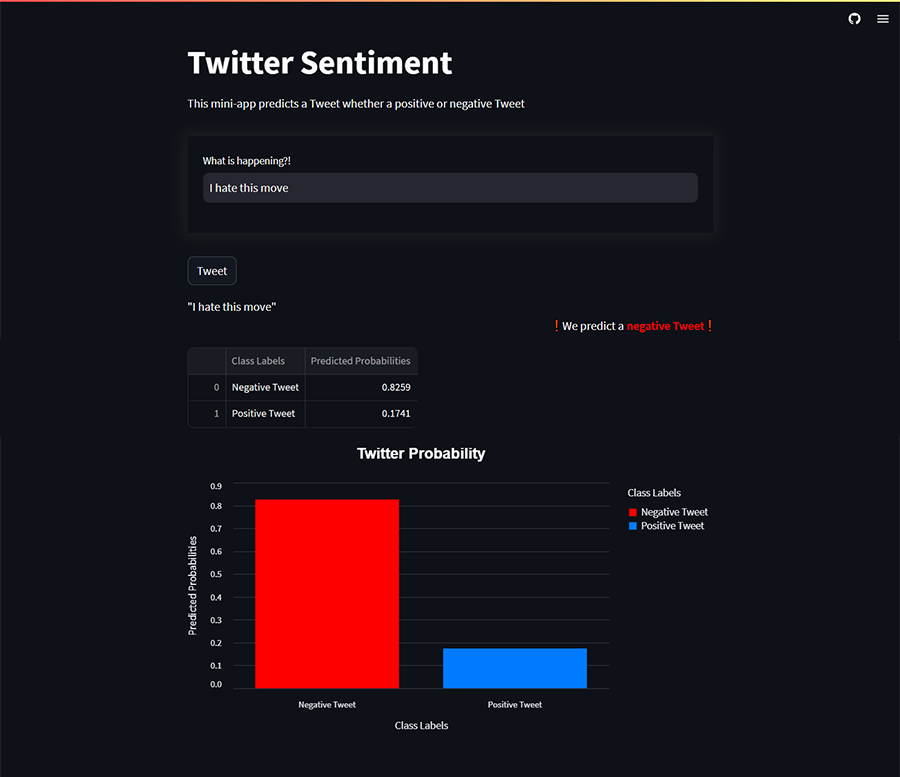

# Twitter Sentiment 

## Breakdown of my Project

### Project Overview

In this project, I am aim to analyze user behavior on Twitter by using machine learning model to determine if the tweet is either positive or negative. The dataset is hosted by <a href="http://help.sentiment140.com/for-students/">sentiment140</a>, this is a real-world data set collected by the authors. The dataset consist of 1.6 million of rows, that labelled as sentiment, and was equally distributed as positive and negative. I also perform various methods of data visualization to convey findings and insights.

I use Machine Learning, a Supervised Learning Model, and Natural Language Processing (NLP) to analyze the tweets, build Classification Models that aim to predict if the tweets are positive or negative.

### Notebooks

1. Data Cleaning and EDA (Exploratory Data Analysis)
2. Preprocessing and Baseline Model
3. Advance Modeling

### Models

1. Logistic Regression
2. SVM (Support Vector Machines)
3. Random Forest
4. XGBoost

## Interactive Website (StreamLit)

I have built out a mini-app Tweet that predicts if a tweet is either positive of negative.

<a href="https://twitter-sentimentapp.streamlit.app/"> Tweet App</a>

A screenshot of the mini-app

